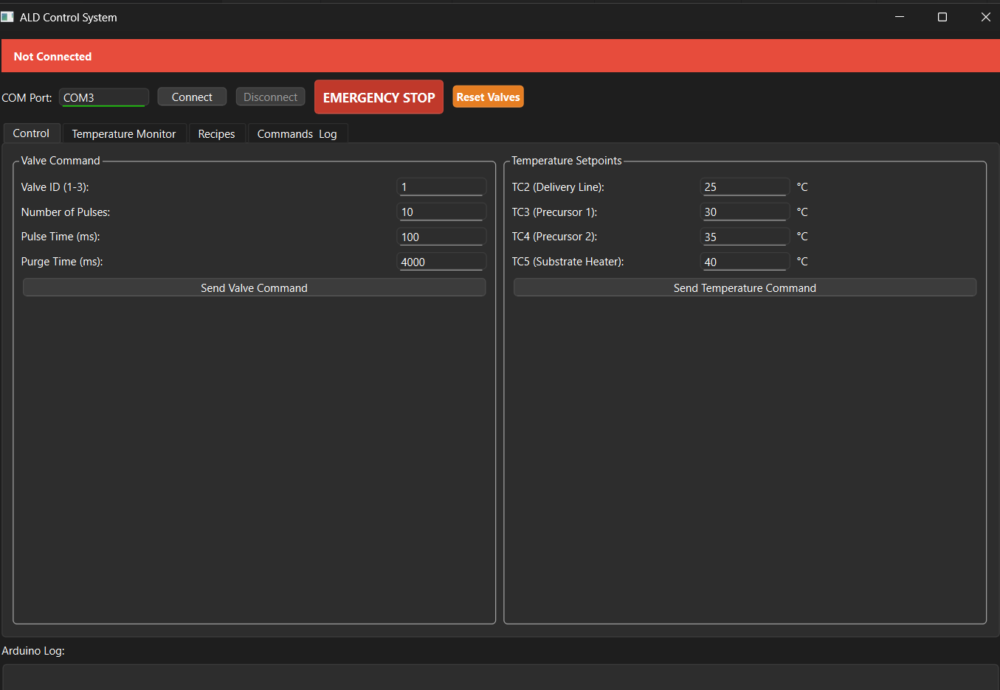
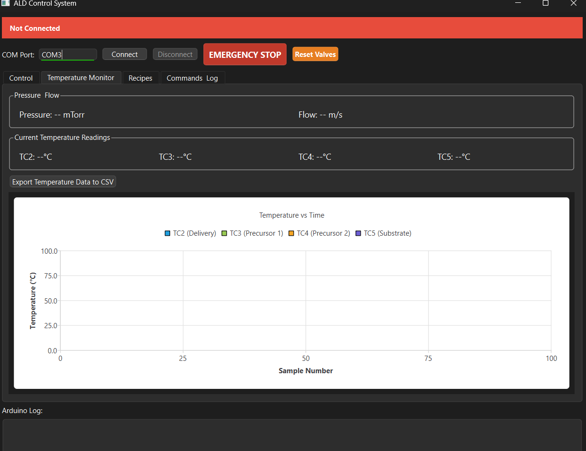
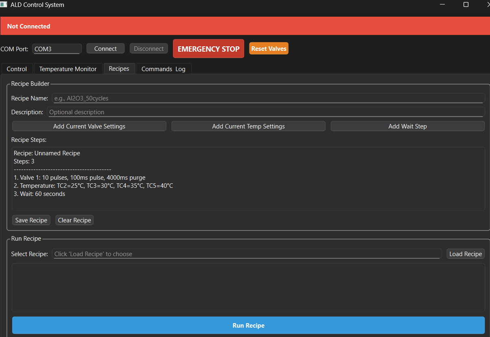

# ALD Control System

Modern Python control software for Atomic Layer Deposition equipment at CMU Hacker Fab.

## Quick Start

```bash
# Install dependencies
pip install PyQt6 PyQt6-Charts qasync pydantic pyserial-asyncio pytest pytest-asyncio pyyaml

# Run GUI
python ald_gui.py
```

## Motivation

### The Problem

The original Tkinter-based GUI for our ALD system suffered from  reliability issues that made it unsuitable for safe use:

- **Unpredictable crashes** - Threading implementation caused the GUI to freeze or crash during experiments
- **Wrong values sent** - Manual string parsing occasionally sent corrupted commands to hardware
- **No input validation** - Invalid parameters could damage equipment or ruin samples
- **Poor error handling** - Crashes provided no useful debugging information
- **Difficult to maintain** - Threading bugs were hard to reproduce and fix

These issues meant users couldn't trust the software during deposition runs, wasting time and materials.

### Solution

This rewrite addresses all reliability issues while adding new capabilities:

- **Async architecture** - Replaces threading with asyncio for stable, non-blocking communication
- **Input validation** - Pydantic models prevent invalid commands before they reach hardware
- **Professional GUI** - PyQt6 provides a modern, crash-resistant interface
- **Real-time monitoring** - Temperature graphs and status indicators for better process control
- **Safety features** - Emergency stop and reset functions for lab safety
- **Comprehensive logging** - All operations logged for troubleshooting and reproducibility


### Impact on Hacker Fab Workflow

This software is the critical middle step in the Hacker Fab process:

```
Recipe → ALD Deposition →  Characterization
        (This software)│    (Analysis)
```

ALD enables:
- Thin film deposition for MEMS, sensors, and nanodevices
- Controlled growth of Al₂O₃, TiO₂, ZnO, and other materials
- Reproducible results through validated parameter control

---

## Display

### Control Tab


*Main control interface with valve commands (left) and temperature setpoints (right). Red status bar shows connection state. Green indicates connected. Emergency stop and reset buttons provide safety controls.*

### Temperature Monitor


*Real-time monitoring dashboard showing:*
- *Pressure gauge reading (mTorr)*
- *Flow sensor reading (m/s)*
- *Four thermocouple temperatures (TC2-TC5)*
- *Live temperature graph with auto-scaling axes*
- *CSV export functionality*

### Recipe Builder


*Recipe management system for automated depositions:*
- *Build multi-step recipes with valve, temperature, and wait commands*
- *Save/load recipes as JSON files*
- *Execute recipes with progress tracking*

---

## Features

### Current Features (v1.0)

- Modern PyQt6 GUI with professional, stable interface
- Real-time temperature monitoring with live graphs of 4 thermocouples
- Pressure gauge monitoring (CVM211GBL)
- Flow sensor monitoring (D6F-W10A1)
- Input validation to prevent equipment damage from invalid commands
- Emergency stop for immediate system lockdown
- Async serial communication for non-blocking, reliable Arduino control
- Recipe system for automated multi-step depositions
- CSV export for temperature data and command logs
- Comprehensive logging of all operations for troubleshooting
- Reset function for soft reset without full emergency stop

---

## Functionality Assessment

### Test Results
```bash
$ pytest -v
========================= test session starts =========================
test_models.py::TestValveCommand::test_valid_valve PASSED
test_models.py::TestValveCommand::test_invalid_valve_id PASSED
test_models.py::TestValveCommand::test_negative_pulses PASSED
test_models.py::TestValveCommand::test_too_many_pulses PASSED
test_models.py::TestValveCommand::test_pulse_time_too_short PASSED
test_models.py::TestValveCommand::test_pulse_time_too_long PASSED
test_models.py::TestValveCommand::test_negative_purge PASSED
test_models.py::TestTempCommand::test_valid_temps PASSED
test_models.py::TestTempCommand::test_negative_temp PASSED
test_models.py::TestTempCommand::test_temp_too_high PASSED
test_models.py::TestTempCommand::test_all_zeros PASSED
test_models.py::TestJobConfig::test_valid_job PASSED
test_models.py::TestJobConfig::test_empty_name PASSED
test_models.py::TestJobConfig::test_whitespace_name PASSED
test_controller.py::TestBasic::test_create_controller PASSED
test_controller.py::TestBasic::test_logger_setup PASSED
test_controller.py::TestWithArduino::test_connect SKIPPED (No Arduino)
test_controller.py::TestWithArduino::test_bad_port PASSED
test_controller.py::TestWithArduino::test_commands SKIPPED (No Arduino)
test_controller.py::TestWithArduino::test_callback SKIPPED (No Arduino)
=================== 17 passed, 3 skipped in 0.52s ====================
```

| Test Suite | Tests | Passed | Skipped | Coverage |
|------------|-------|--------|---------|----------|
| `TestValveCommand` | 7 | 7 | 0 | Valve input validation |
| `TestTempCommand` | 4 | 4 | 0 | Temperature validation |
| `TestJobConfig` | 3 | 3 | 0 | Job configuration |
| `TestBasic` | 2 | 2 | 0 | Controller instantiation |
| `TestWithArduino` | 4 | 1  | 3 | Hardware integration |
| **Total** | **20** | **17** | **3** | **100% (excl. hardware)** |

> **Note:** `TestWithArduino` tests require physical Arduino connection and are skipped in CI environments.

### Feature Completion

| Feature | Status | Notes |
|---------|--------|-------|
| Async Serial Communication |  Complete | Replaced threading with asyncio |
| Temperature Monitoring |  Complete | 4 thermocouples (TC2-TC5) |
| Pressure Monitoring |  Complete | CVM211GBL gauge support |
| Flow Monitoring |  Complete | D6F-W10A1 sensor support |
| Valve Control |  Complete | 3 valves with pulse/purge timing |
| Input Validation |  Complete | Pydantic models |
| Emergency Stop |  Complete | Hardware lockout |
| Soft Reset |  Complete | Clear pulse counter |
| Recipe System |  Complete | Save/load/execute |
| CSV Export |  Complete | Temp data + command history |

### Validation Ranges

| Parameter | Valid Range | Enforced By |
|-----------|-------------|-------------|
| Valve ID | 1-3 | Pydantic model |
| Number of Pulses | 1-1000 | Pydantic model |
| Pulse Time | 10-10000 ms | Pydantic model |
| Purge Time | 0-15000 ms | Pydantic model |
| Temperature | 0-500°C | Pydantic model |

### Known Issues

| Issue | Severity | Workaround |
|-------|----------|------------|
| Task conflict during recipe execution | Medium | Status timer skipped during recipes |
| No recipe pause/resume | Low | Use emergency stop if needed |
| Graph clears on reconnect | Low | Export data before disconnect |

---

## Design Decisions

### Why Async Instead of Threading?

The original Tkinter GUI used Python threading, which caused race conditions and crashes when multiple threads accessed the serial port simultaneously.

| Approach | Pros | Cons |
|----------|------|------|
| Threading | Familiar | Race conditions, GUI crashes |
| Multiprocessing | True parallelism | Complex IPC, high overhead |
| **Asyncio** | Single-threaded, no races | Learning curve |

**Our solution:** `asyncio` + `qasync` provides single-threaded concurrency with non-blocking I/O, eliminating race conditions entirely.

### Why Pydantic for Validation?

| Approach | Pros | Cons |
|----------|------|------|
| Manual `if` checks | Simple | Easy to miss edge cases |
| JSON Schema | Standard | Verbose, no Python integration |
| **Pydantic** | Type hints, clear errors, fast | Extra dependency |

Pydantic catches errors like `valve_id=5` or `pulse_time=-100` before they reach hardware, with clear error messages.

### Why PyQt6 Over Tkinter?

| Feature | Tkinter | PyQt6 |
|---------|---------|-------|
| Built-in Charts |  External libs |  PyQt6-Charts |
| Async Support |  Poor |  Good (qasync) |
| Styling | Limited | Full CSS-like QSS |
| Threading Safety |  Crashes |  Stable |
| Look & Feel | Dated | Modern, native |

---

## Installation

### Prerequisites

- Python 3.9 or newer
- Arduino Uno with uploaded firmware
- Windows, Mac, or Linux

### Step-by-Step Installation

#### Method 1: Direct Install

**Windows:**
```batch
python -m pip install PyQt6 PyQt6-Charts qasync pydantic pyserial-asyncio pytest pytest-asyncio pyyaml
```

**Mac/Linux:**
```bash
pip3 install PyQt6 PyQt6-Charts qasync pydantic pyserial-asyncio pytest pytest-asyncio pyyaml
```

#### Method 2: From requirements.txt

```bash
pip install -r requirements.txt
```

#### Verify Installation

```bash
python -c "from ald_controller import ALDController; print('Installation successful')"
```

### Arduino Setup

1. Open `ald_manual_control.ino` in Arduino IDE
2. Select **Tools → Board → Arduino Uno**
3. Select **Tools → Port → [Your COM Port]**
4. Click **Upload**
5. Wait for "Done uploading"

>  **Warning:** Do not flash old firmware, pin mappings have changed!

---

## Usage

### Quick Start

1. Connect Arduino to computer via USB
2. Run GUI: `python ald_gui.py`
3. Enter COM port (Usually COM3 on Windows, /dev/ttyUSB0 on Linux)
4. Click Connect
5. Use Control tab to send commands

### Daily Operation

#### Starting a Deposition Run

1. Set temperature targets for all heating zones
2. Click "Send Temperature Command"
3. Wait for temperatures to stabilize (monitor graph)
4. Configure valve parameters (pulses, timing)
5. Click "Send Valve Command"
6. Monitor progress in Arduino log

#### Emergency Procedures

| Situation | Action | Result |
|-----------|--------|--------|
| Normal stop | Click **Reset Valves** (orange) | Clears command, system operational |
| Emergency | Click **EMERGENCY STOP** (red) | All off, Arduino locks |
| After E-Stop | Disconnect, restart Arduino, reconnect | System recovers |

### Command Reference

#### Valve Control

```
Command format: v[valve_id];[num_pulses];[pulse_time_ms];[purge_time_ms]
Example: v1;10;100;4000
```

Parameters:
- `valve_id`: 1, 2, or 3
- `num_pulses`: 1-1000 (number of ALD cycles)
- `pulse_time_ms`: 10-10000 (precursor exposure time)
- `purge_time_ms`: 0-15000 (nitrogen purge duration)

#### Temperature Control

```
Command format: t[tc2];[tc3];[tc4];[tc5]
Example: t100;150;200;250
```

Parameters:
- All temperatures in °C (integers only)
- Valid range: 0-500°C
- TC2: Delivery line
- TC3: Precursor 1
- TC4: Precursor 2
- TC5: Substrate heater

#### Emergency Commands

- `s` - Emergency stop (locks Arduino)
- `r` - Reset pulse counter (soft reset)

---

## System Architecture

### Component Responsibilities

| File | Layer | Purpose |
|------|-------|---------|
| `ald_gui.py` | GUI | User interface, visualization, error handling |
| `ald_controller.py` | Communication | Async serial, command formatting, response parsing |
| `ald_models.py` | Data | Pydantic validation, type safety, range checking |
| `ald_recipe.py` | Automation | Recipe save/load/execute |
| `ald_manual_control.ino` | Hardware | Thermocouple reading, relay control, safety interlocks |

### Data Flow

**Command Flow (PC → Arduino):**
```
User Input → Pydantic Validation → Format Command → Serial Write → Arduino Parse → Execute
```

**Response Flow (Arduino → PC):**
```
Arduino Sensor → Serial Print → Async Read → Parse Data → Update GUI
```

---

## Tech Stack

### Software Dependencies

| Package | Version | License | Purpose |
|---------|---------|---------|---------|
| PyQt6 | 6.6+ | GPL v3 | GUI framework |
| PyQt6-Charts | 6.6+ | GPL v3 | Temperature graphs |
| qasync | 0.24+ | BSD | Qt + asyncio bridge |
| Pydantic | 2.5+ | MIT | Input validation |
| pyserial-asyncio | 0.6+ | BSD | Async serial communication |
| pytest | 7.4+ | MIT | Unit testing |
| PyYAML | 6.0+ | MIT | Config files |

### Hardware Components

| Component | Model | Purpose |
|-----------|-------|---------|
| Microcontroller | Arduino Uno (ATmega328P) | Main controller |
| Thermocouple Amplifier | MAX31855 (x4) | K-type temperature reading |
| Pressure Gauge | Stinger CVM211GBL | Chamber pressure |
| Flow Sensor | Omron D6F-W10A1 | Gas flow rate |
| Valve Control | MOSFETs (Active HIGH) | Pneumatic valves |
| Heater Control | Relays (Active LOW) | Heating elements |

### System Requirements

| Requirement | Minimum | Recommended |
|-------------|---------|-------------|
| OS | Windows 10 / macOS 10.14 / Linux | Latest |
| Python | 3.9 | 3.11+ |
| RAM | 512 MB | 1 GB |
| Storage | 50 MB | 100 MB |
| Display | 1024x768 | 1280x720+ |

---

## Development

### Project Structure

```
controls/
├── ald_gui.py              # Main GUI application
├── ald_controller.py       # Serial communication
├── ald_models.py           # Data validation models
├── ald_recipe.py           # Recipe management
├── ald_manual_control.ino  # Arduino firmware
├── test_controller.py      # Unit tests
├── test_models.py          # Validation tests
├── demo_controller.py      # Interactive demo
├── requirements.txt        # Python dependencies
├── README.md               # This file
└── recipes/                # Saved recipe files
    └── *.json
```

### Running Tests

```bash
# Run all tests
pytest -v

# Run specific test suite
pytest test_controller.py -v
pytest test_models.py -v
```

---

## Troubleshooting

### Common Issues

| Problem | Solution |
|---------|----------|
| Can't connect to Arduino | Check COM port in Device Manager, close Arduino IDE |
| "Command Ignored" error | Wait for completion or click Reset Valves |
| Temperature graph not updating | Check thermocouple wiring, verify Arduino Serial Monitor |
| GUI crashes on startup | Verify Python 3.9+, reinstall dependencies |
| Validation error | Check input ranges (see Validation Ranges table) |

### Debug Mode

Check the log file for detailed error information:
```bash
cat ald_controller.log
```

---

## Future Improvements

### Completed
-  Async serial communication
-  PyQt6 GUI with tabs
-  Real-time temperature graphs
-  Pressure and flow monitoring
-  Input validation
-  Emergency stop
-  Recipe system
-  CSV export
-  Logging

### Planned
- Recipe pause/resume functionality
- Configuration files (YAML)
- Historical data analysis
- Web interface for remote monitoring

---

## License

This project is licensed under the **MIT License**.

This project uses PyQt6 which is licensed under GPL v3. As required by the GPL, this software is also available under open-source terms, which aligns with Hacker Fab's mission to create open-source, replicable work.

---

## Contact

**Author:** Mohid Rattu  
**Email:** mrattu@andrew.cmu.edu  
**GitHub:** [github.com/hacker-fab/ald](https://github.com/hacker-fab/ald)

**Acknowledgments:**
- CMU Hacker Fab team
- Joel Gonzalez, Jay Kunselman, Atharva Raut (Arduino firmware)
- 18-610 instructors

---

**CMU Hacker Fab 2025**
